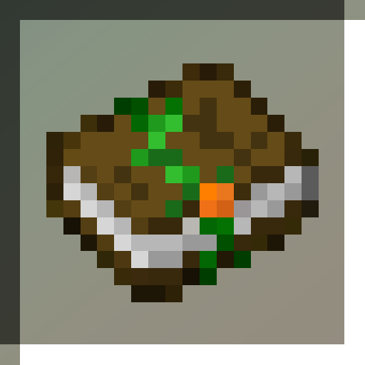

<h1 align="center">Harvesting Enchantment 

</h1>

A lightweight mod that adds a new enchantment for hoes to make farming easier: **Harvesting**.
When using a hoe with this enchantment on any grown crop, it gets harvested
without the need of manual replanting.

## Environment

The mod is server-side. Installing on client is purely optional, as it only provides additional
lang entries and a swing animation when harvesting.

## Tags

The mod provides the following tags for datapacks:

#### Blocks:

- `#harvesting_enchantment:non_harvestable` - for blocks that shouldn't be harvestable with the
  enchantment

#### Items:

- `#harvesting_enchantment:enchantable/harvesting` - for items that can support the enchantment

## Compatibility

The mod is compatible with all vanilla crops (Wheat, Carrots, Potatoes, Beetroots) and should be
compatible with basic modded crops. Please report any incompatibilities
on [the issues page](https://github.com/dudek26/Harvesting-Enchantment/issues).
